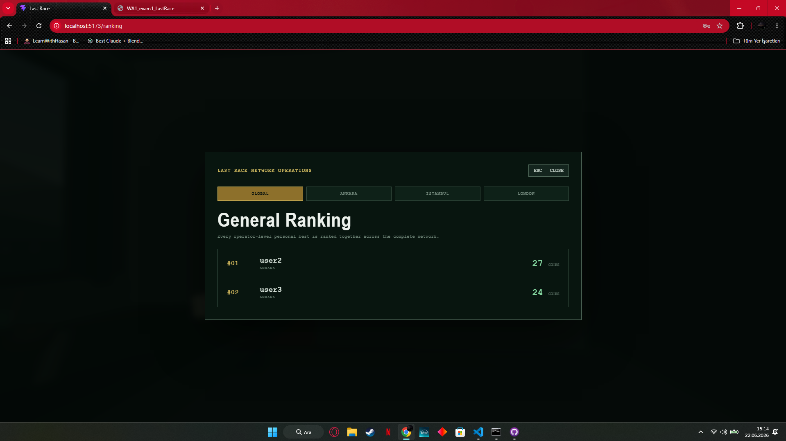
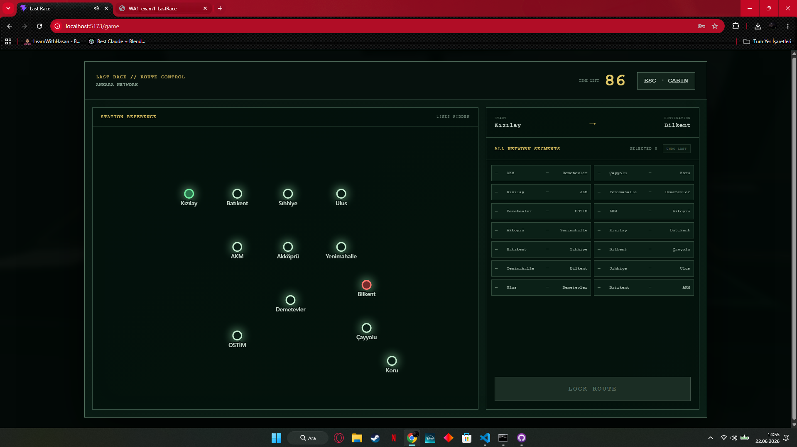

# Exam #1: "Last Race"
## Student: 354820 CAN UMUT

## React Client Application Routes

- `/`: redirects anonymous users to the public main menu and authenticated users to the driver cabin.
- `/login`: public main menu, game instructions, and operator authentication form.
- `/hub`: protected first-person driver cabin with the in-world route terminal and ranking panel.
- `/game`: protected full-screen 2D route terminal containing setup, planning, execution, and result phases for the selected level.
- `/ranking`: protected full-screen ranking with Global, Ankara, Istanbul, and London tabs.

## API Server

- `POST /api/login` — body `{ username, password }`; authenticates through Passport and starts a session.
- `POST /api/logout` — closes the authenticated session.
- `GET /api/check-login` — returns the authentication state and, when logged in, `{ id, username }`.
- `GET /api/health` — public server and SQLite availability check.
- `GET /api/map?level=...` — returns the stations and ordered lines of the selected Ankara, Istanbul, or London network.
- `GET /api/game/init?level=...` — creates a 90-second game on the selected level with server-selected stations and all shuffled segments.
- `POST /api/game/validate` — body `{ route: [{ s1, s2 }] }`; validates time, continuity, connections, line changes, repeated segments, and destination.
- `GET /api/ranking?level=...` — returns each user's best score for one level. With `level=Overall`, it ranks every user-level personal best together.

## Database Tables

- `users` — registered operators and salted bcrypt password hashes.
- `stations` — unique station names for the Ankara, Istanbul, and London levels.
- `lines` — unique underground lines for all three playable levels.
- `line_stations` — ordered station membership for every line.
- `connections` — valid adjacent station pairs and their line.
- `events` — random event descriptions and effects from -4 to +4.
- `games` — completed valid games, score, level, user, and timestamp.
- `app_meta` — seed version metadata.

## Main React Components

- `AppRoutes` — authentication state and protected/public route organization.
- `MainMenu` — public instructions and login interface.
- `CabinLayout` — keeps the active game mounted while switching between `/hub` and `/ranking`.
- `ControlRoom3D` — first-person cabin, timer, persistent game state, pause menu, and interactive in-world panels.
- `TerminalScreen` — full-screen 2D interface for Easy Ankara, Medium Istanbul, and Hard London.
- `GeneralRankingWall` — interactive in-cabin panel that opens the ranking interface.
- `RankingPage` — full-screen ranking with Global and per-level tabs, closed with ESC.

## Screenshots

### General Ranking

### During a Game

## Users Credentials

- `user1`, `password1`
- `user2`, `password2`
- `user3`, `password3`

## Use of AI Tools

OpenAI Codex was used to clarify requirements, debug client/server integration, review API and database design, and assist with the 3D interface. Its output was adapted to the project and verified through production builds, API tests, SQLite queries, and manual browser testing.
